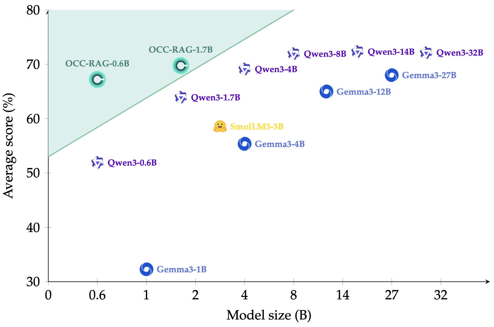
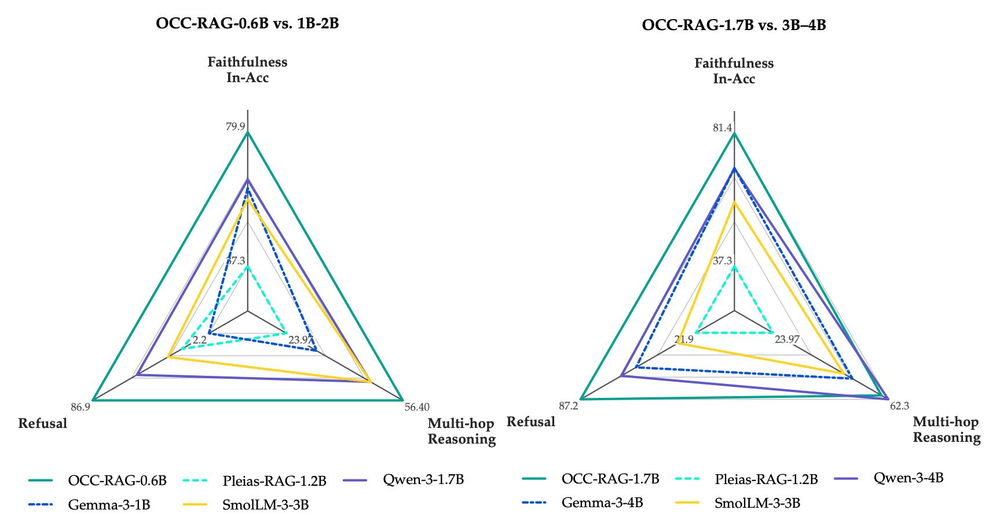

<p align="center">
  
</p>

<p align="center">
  
</p>

<p align="center">
  🤗 <a href="https://huggingface.co/collections/occ-ai/occ-rag-6a1985edcff89db09aef719c"><b>Hugging Face</b></a> &nbsp;|&nbsp;
  📄 <a href="https://arxiv.org/abs/2606.00683"><b>Technical Report</b></a> &nbsp;|&nbsp;
  ☁️ <a href="https://cloud.ru/products/evolution-ml-inference"><b>Cloud</b></a>
</p>

# OCC-RAG: Optimal Cognitive Core for Faithful Question Answering

**OCC-RAG** is a family of small language models specialized for **faithful, context-grounded question answering**. Given a question and a set of sources, the model produces a structured reasoning trace with explicit source citations, decides whether the context supports an answer, and either answers from the context or abstains.

Despite their size, OCC-RAG models match or exceed general-purpose models **2–6× larger** on multi-hop reasoning, faithfulness, and refusal benchmarks, and attain the best faithfulness across all evaluated scales (up to 32B). They are mid-trained from Qwen3 base models on a large synthetic corpus of multi-context, multi-hop QA with citation-anchored reasoning traces.

## Key Features

- 🎯 **Faithful by design** — answers only from the supplied context; the strongest ConFiQA faithfulness across all evaluated scales, including 32B models.
- 🛑 **Calibrated abstention** — outputs `Not enough information` when the context does not support an answer.
- 🔗 **Structured, citable reasoning** — every answer ships with a transparent trace (query analysis → source analysis → reasoning → status → answer) that cites sources by id.
- 📦 **Compact** — small models that deliver chain-of-thought-level transparency at a fraction of full thinking-mode inference cost.

## Model Zoo

| Model | HuggingFace | Params | Base |
|---|---|---|---|
| OCC-RAG-0.6B | [🤗 occ-ai/OCC-RAG-0.6B](https://huggingface.co/occ-ai/OCC-RAG-0.6B) | 0.6B | [Qwen/Qwen3-0.6B-Base](https://huggingface.co/Qwen/Qwen3-0.6B-Base) |
| OCC-RAG-1.7B | [🤗 occ-ai/OCC-RAG-1.7B](https://huggingface.co/occ-ai/OCC-RAG-1.7B) | 1.7B | [Qwen/Qwen3-1.7B-Base](https://huggingface.co/Qwen/Qwen3-1.7B-Base) |

## Performance

<p align="center">
  
</p>

Main results across multi-hop reasoning (HotpotQA, MuSiQue, TAT-QA), faithfulness (ConFiQA), and refusal (MuSiQue-Un). In-Acc = the gold answer appears as a substring of the prediction; F1 = token-level overlap; M_R = memorization ratio (lower = more faithful); R-Acc = refusal accuracy. ConFiQA metrics are averaged across QA, MR, and MC subsets. Parentheses denote thinking-mode results.

| Model | HotpotQA<br>In-Acc | MuSiQue<br>In-Acc | TAT-QA<br>F1 | ConFiQA<br>In-Acc | ConFiQA<br>M_R ↓ | MuSiQue-Un<br>R-Acc |
|---|---|---|---|---|---|---|
| gemma-3-4b-it       | 55.8 | 30.1 | 65.3 | 69.8 | 8.9 | 55.8 |
| gemma-3-12b-it      | 66.5 | 44.6 | 76.5 | 72.0 | 7.6 | 65.3 |
| gemma-3-27b-it      | 69.6 | **51.0** | 75.4 | 73.0 | 8.0 | 71.1 |
| Qwen3-0.6B (think)  | 41.8 | 17.2 | 66.3 | 64.5 | 8.2 | 70.0 |
| Qwen3-1.7B (think)  | 60.9 | 30.7 | 74.8 | 70.4 | 8.3 | 82.8 |
| Qwen3-4B   (think)  | 67.1 | 41.5 | 79.1 | 74.1 | 7.5 | 84.0 |
| Qwen3-8B   (think)  | 70.3 | 43.9 | 74.5 | 77.6 | 6.9 | **90.7** |
| Qwen3-32B  (think)  | **71.4** | 49.3 | 76.7 | 75.8 | 8.5 | 87.0 |
| SmolLM3-3B (think)  | 56.5 | 29.4 | 69.7 | 60.5 | 13.3 | 77.1 |
| Pleias-RAG-1.2B     | 48.5 | 15.0 |  8.4 | 37.3 | 25.3 | 21.9 |
| **OCC-RAG-0.6B**    | 57.6 | 36.6 | 75.0 | 79.9 | _5.2_ | 86.9 |
| **OCC-RAG-1.7B**    | 60.9 | 38.2 | **81.0** | **81.4** | **5.0** | 87.2 |

Full results (incl. non-thinking-mode Qwen3 numbers and additional baselines) are in the [technical report](https://arxiv.org/abs/2606.00683).

## Installation

```bash
pip install -r requirements.txt
```

## Quick Start

The chat template accepts a `documents=` kwarg and emits the structural tokens for the query and sources automatically — pass the user message as plain text and the sources as a list of dicts.

```python
import re
from transformers import AutoModelForCausalLM, AutoTokenizer

MODEL = "occ-ai/OCC-RAG-1.7B"

tokenizer = AutoTokenizer.from_pretrained(MODEL)
model = AutoModelForCausalLM.from_pretrained(MODEL, torch_dtype="auto", device_map="auto")

question = "Which country is the inventor of the telephone, Alexander Graham Bell, buried in?"
documents = [
    {"text": "Alexander Graham Bell was a Scottish-born inventor best known for patenting the first practical telephone."},
    {"text": "Bell died on August 2, 1922, at his estate Beinn Bhreagh, near Baddeck, Nova Scotia, and was buried there."},
    {"text": "Nova Scotia is a province on the east coast of Canada."},
]

text = tokenizer.apply_chat_template(
    [{"role": "user", "content": question}],
    documents=documents,
    tokenize=False,
    add_generation_prompt=True,
    enable_thinking=False,
)

# Alternative: assemble the structural tokens yourself.
#
# query_start, query_end = "<|query_start|>", "<|query_end|>"
# source_start, source_end, source_id = "<|source_start|>", "<|source_end|>", "<|source_id|>"
#
# def build_user_content(question, sources):
#     content = f"{query_start}{question}{query_end}\n"
#     for i, s in enumerate(sources, start=1):
#         content += f"{source_start}{source_id}{i} {s}{source_end}\n"
#     return content
#
# messages = [{"role": "user", "content": build_user_content(question, [d["text"] for d in documents])}]
# text = tokenizer.apply_chat_template(
#     messages, tokenize=False, add_generation_prompt=True, enable_thinking=False
# )

inputs = tokenizer([text], return_tensors="pt").to(model.device)
outputs = model.generate(**inputs, max_new_tokens=2048)
response = tokenizer.decode(outputs[0][inputs.input_ids.shape[1]:], skip_special_tokens=False)
print(response)

m = re.findall(r"<\|answer_start\|>(.*?)(?:<\|answer_end\|>|\Z)", response, re.DOTALL)
print("Answer:", m[-1].strip() if m else "")  # -> Canada
```

For batched, GPU-accelerated inference with vLLM and a helper that parses **all five** response sections, see [`examples/quickstart_vllm.py`](examples/quickstart_vllm.py). The Transformers equivalent with section parsing is in [`examples/quickstart_transformers.py`](examples/quickstart_transformers.py).

When serving via vLLM (≥0.6) or SGLang (≥0.4.7), the same `documents=` kwarg is reachable from an OpenAI client through `chat_template_kwargs`:

```python
client.chat.completions.create(
    model=MODEL,
    messages=[{"role": "user", "content": question}],
    extra_body={"chat_template_kwargs": {"documents": documents}},
)
```

> [!NOTE]
> We recommend greedy decoding (`do_sample=False`, `temperature=0.0`), which is the training/evaluation default and is baked into each model's `generation_config.json`. Qwen3's default sampling parameters also work.

## Input / Output Format

OCC-RAG uses a **structured prompt format with special tokens**. The question is wrapped in `<|query_start|> … <|query_end|>` and each source in `<|source_start|><|source_id|>N … <|source_end|>`.

The response is split into five sections, each delimited by special tokens:

| Section | Tokens | Content |
|---|---|---|
| Query analysis  | `<\|query_analysis_start\|> … <\|query_analysis_end\|>`   | Decomposes the question into what must be found. |
| Source analysis | `<\|source_analysis_start\|> … <\|source_analysis_end\|>` | Assesses each source's relevance, citing by `<\|source_id\|>N`. |
| Reasoning       | `<\|reasoning_start\|> … <\|reasoning_end\|>`             | Composes evidence across sources into a multi-hop chain. |
| Status          | `<\|status_start\|> … <\|status_end\|>`                   | `ANSWERABLE` / `UNANSWERABLE` verdict. |
| Answer          | `<\|answer_start\|> … <\|answer_end\|>`                   | The final answer span, or the refusal phrase. |

## Contact Us

Questions, feedback, or collaboration ideas — reach out at [a.v.galichin@gmail.com](mailto:a.v.galichin@gmail.com).

## Citation

If you find our work helpful, feel free to give us a cite.

```bibtex
@misc{savkin2026occragoptimalcognitivecore,
  title         = {OCC-RAG: Optimal Cognitive Core for Faithful Question Answering},
  author        = {Maksim Savkin and Mikhail Goncharov and Alexander Gambashidze and Alla Chepurova and Dmitrii Tarasov and Nikita Andriianov and Daria Pugacheva and Vasily Konovalov and Andrey Galichin and Ivan Oseledets},
  year          = {2026},
  eprint        = {2606.00683},
  archivePrefix = {arXiv},
  primaryClass  = {cs.CL},
  url           = {https://arxiv.org/abs/2606.00683}
}
```
